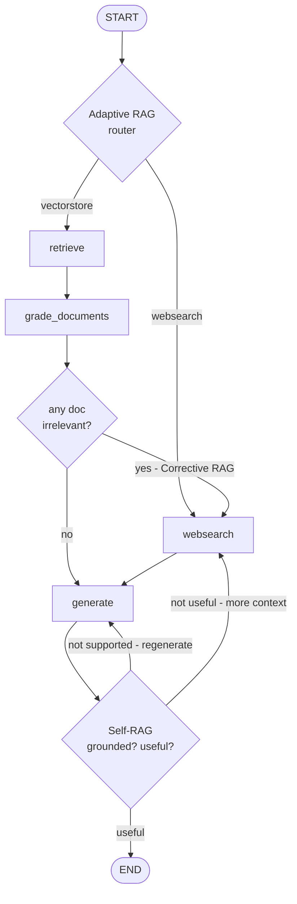

# Agentic RAG

A local-first **agentic RAG** system built with [LangGraph](https://github.com/langchain-ai/langgraph), combining three research patterns — **Adaptive RAG**, **Corrective RAG (CRAG)**, and **Self-RAG** — into a single self-correcting workflow.

Instead of the classic "retrieve once, generate once" pipeline, this graph reasons about its own retrieval and its own answers: it decides *where* to look, checks whether what it found is actually relevant, falls back to web search when it isn't, and refuses to ship an answer that is hallucinated or off-topic.

Everything runs locally through [Ollama](https://ollama.com) — no OpenAI key required. The only external service is [Tavily](https://tavily.com) for web search.

---

## The three patterns

| Pattern | Question it answers | Where it lives |
| --- | --- | --- |
| **Adaptive RAG** | *Should I even use the vector store for this question?* | [`graph/chains/router.py`](graph/chains/router.py) |
| **Corrective RAG** | *Are the retrieved documents actually relevant? If not, what do I do?* | [`graph/chains/retrieval_grader.py`](graph/chains/retrieval_grader.py), [`graph/nodes/grade_documents.py`](graph/nodes/grade_documents.py) |
| **Self-RAG** | *Is my answer grounded in the sources, and does it address the question?* | [`graph/chains/hallucination_grader.py`](graph/chains/hallucination_grader.py), [`graph/chains/answer_grader.py`](graph/chains/answer_grader.py) |

### Adaptive RAG — route before you retrieve

The entry point is a conditional edge, not a node. An LLM router classifies the incoming question against the known scope of the index (agents, prompt engineering, adversarial attacks on LLMs) and returns a structured `datasource` of either `vectorstore` or `websearch`. Questions about last week's news skip the vector store entirely; questions about agent memory go straight to retrieval.

### Corrective RAG — grade the documents, not just the answer

After retrieval, every document is graded for relevance one at a time. Irrelevant documents are dropped from the state rather than being passed to the generator as noise. If *any* document was dropped, a `web_search` flag flips to `True` and the graph detours through Tavily to top up the context before generating.

### Self-RAG — grade the generation

Generation is not the end of the graph. The answer is scored twice:

1. **Grounded in the documents?** If not, the graph loops back and regenerates.
2. **Does it address the question?** If not, the graph routes to web search for better context and tries again.

Only an answer that passes both checks reaches `END`.

---

## Architecture



A rendered PNG of the compiled graph is written to `graph/graph.png` on every import of `graph.graph`.

### Shared state

Every node reads and writes a single `GraphState` ([`graph/state.py`](graph/state.py)):

```python
class GraphState(TypedDict):
    question: str         # the user's question
    generation: str       # the LLM's answer
    web_search: bool      # did document grading fail?
    documents: List[str]  # the working context
```

---

## Project structure

```
agentic-rag/
├── ingestion.py                     # Loads blog posts → chunks → Chroma vector store
├── main.py                          # Entry point
└── graph/
    ├── graph.py                     # Node wiring, conditional edges, compiled app
    ├── state.py                     # GraphState
    ├── consts.py                    # Node name constants
    ├── chains/
    │   ├── router.py                # Adaptive RAG: vectorstore vs. websearch
    │   ├── retrieval_grader.py      # Corrective RAG: is this document relevant?
    │   ├── generation.py            # The RAG answer chain
    │   ├── hallucination_grader.py  # Self-RAG: grounded in the facts?
    │   ├── answer_grader.py         # Self-RAG: does it answer the question?
    │   └── tests/test_chains.py     # Unit tests for each chain
    └── nodes/
        ├── retrieve.py
        ├── grade_documents.py
        ├── generate.py
        └── web_search.py
```

Each grader is a small, independently testable chain: a prompt piped into an LLM with `with_structured_output(...)`, so every decision comes back as a validated Pydantic model rather than a string that has to be parsed.

---

## Getting started

### Prerequisites

- Python 3.12+
- [uv](https://docs.astral.sh/uv/)
- [Ollama](https://ollama.com), running locally
- A [Tavily](https://tavily.com) API key (the free tier is enough)

### 1. Pull the models

```bash
ollama pull qwen3:1.7b        # reasoning, routing, and grading
ollama pull nomic-embed-text  # embeddings
```

### 2. Install dependencies

```bash
git clone git@github.com:HenrikGharagyozyan/agentic-rag.git
cd agentic-rag
uv sync
```

### 3. Configure the environment

Create a `.env` file in the project root:

```env
TAVILY_API_KEY=your-tavily-key

# Optional — LangSmith tracing
LANGSMITH_TRACING=true
LANGSMITH_ENDPOINT=https://api.smith.langchain.com
LANGSMITH_API_KEY=your-langsmith-key
LANGSMITH_PROJECT=agentic-rag
```

### 4. Run it

```bash
uv run python main.py
```

On the first run, `ingestion.py` fetches three [Lilian Weng](https://lilianweng.github.io) blog posts, chunks them, embeds them with `nomic-embed-text`, and persists a Chroma store to `./.chroma`. Subsequent runs reuse it, so startup is fast.

The graph narrates its decisions as it goes:

```
---ROUTE QUESTION---
---ROUTE QUESTION TO RAG---
---RETRIEVE---
---CHECK DOCUMENT RELEVANCE TO QUESTION---
---GRADE: DOCUMENT RELEVANT---
---GRADE: DOCUMENT NOT RELEVANT---
---ASSESS GRADED DOCUMENTS---
---DECISION: NOT ALL DOCUMENTS ARE RELEVANT TO QUESTION, INCLUDE WEB SEARCH---
---WEB SEARCH---
---GENERATE---
---CHECK HALLUCINATIONS---
---DECISION: GENERATION IS GROUNDED IN DOCUMENTS---
---GRADE GENERATION vs QUESTION---
---DECISION: GENERATION ADDRESSES QUESTION---
```

### Asking your own questions

```python
from graph.graph import app

result = app.invoke(input={"question": "what is agent memory?"})
print(result["generation"])
```

---

## Running the tests

```bash
uv run pytest
```

The suite exercises each chain in isolation — the retrieval grader on both relevant and irrelevant documents, the hallucination grader on both grounded and fabricated answers, and the router on questions inside and outside the index's scope.

> **Note:** the tests call a real LLM and a real vector store, so they are slow (minutes, not seconds) and Ollama must be running.

### Running individual modules

Modules import through the `graph.*` package path, so run them as modules from the project root rather than by file path:

```bash
uv run python -m graph.nodes.web_search   # works
uv run python graph/nodes/web_search.py   # ModuleNotFoundError: No module named 'graph'
```

---

## Tech stack

| Layer | Choice |
| --- | --- |
| Orchestration | LangGraph |
| LLM | Ollama (`qwen3:1.7b`) |
| Embeddings | Ollama (`nomic-embed-text`) |
| Vector store | Chroma (persisted locally) |
| Web search | Tavily |
| Structured output | Pydantic |
| Observability | LangSmith (optional) |

---

## Further reading

- [Adaptive RAG](https://arxiv.org/abs/2403.14403) — Jeong et al., 2024
- [Corrective RAG](https://arxiv.org/abs/2401.15884) — Yan et al., 2024
- [Self-RAG](https://arxiv.org/abs/2310.11511) — Asai et al., 2023

---

## License

Released under the [MIT License](LICENSE).
